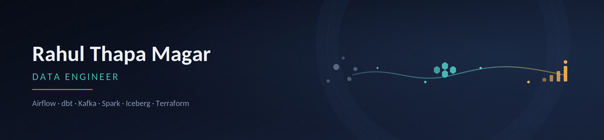

### Hi, I'm Rahul 👋 , an aspiring Data Engineer building cloud-native pipelines and lakehouses

I hold a Bachelor's in Computer Science and a Master's in Data Analytics, and I build end-to-end data engineering projects that are meant to hold up under real scrutiny, automated tests, data contracts, and CI pipelines included, not just a notebook that ran once.

## 🛠️ Tech Stack

## Featured Projects

Each project below targets a different part of the modern data stack. All 5 have working code, not just architecture diagrams : click through to the README for the full design writeup.

### [E-Commerce ELT Pipeline & Data Contract-Enforced Lakehouse](https://github.com/rtmagar/ecommerce-elt-pipeline)
Airflow + dbt + MinIO pipeline extracting 9 OLTP tables (~100,000 orders) via 18 dynamically generated tasks. JSON Schema data contracts block schema drift at extraction; 10 automated dbt tests gate every model build.

### [Real-Time Context Engineering for Autonomous AI Agents](https://github.com/rtmagar/real-time_context-engineering_project)
Streaming RAG pipeline : Kafka + PySpark Structured Streaming generate 384-dim vector embeddings locally (no external LLM API calls). Hybrid Qdrant search combines cosine similarity with a rolling 5-minute time filter for an AI agent's short-term memory.

### [Fintech Transaction Monitoring & Risk Lakehouse](https://github.com/rtmagar/fintech-risk-lakehouse)
Medallion-architecture (Bronze/Silver/Gold) lakehouse on Apache Iceberg, streaming payment events via Redpanda. Terraform-provisioned infrastructure, a 3-rule automated data quality gate, and a **GitHub Actions CI pipeline** running PySpark unit tests on every push.

### [IoT Modern Lakehouse & ML Feature Store](https://github.com/rtmagar/iot-lakehouse-feature-store)
Spark-aggregated ML features (temperature, vibration, anomaly count) from streaming IoT telemetry, stored in Apache Iceberg and served point-in-time-correct via a Feast feature store.

### [Retail ETL Pipeline](https://github.com/rtmagar/retail-etl-pipeline)
Python/Flask/PostgreSQL ETL processing 500,000 synthetic records, with a mock POS API that includes a "chaos mode" to stress-test the pipeline's own deduplication logic.

## GitHub Stats

## Let's Connect

I'm actively looking for entry-level Data Engineer roles. Always happy to talk about Airflow DAG design, dbt incremental models, or anything lakehouse-related.
